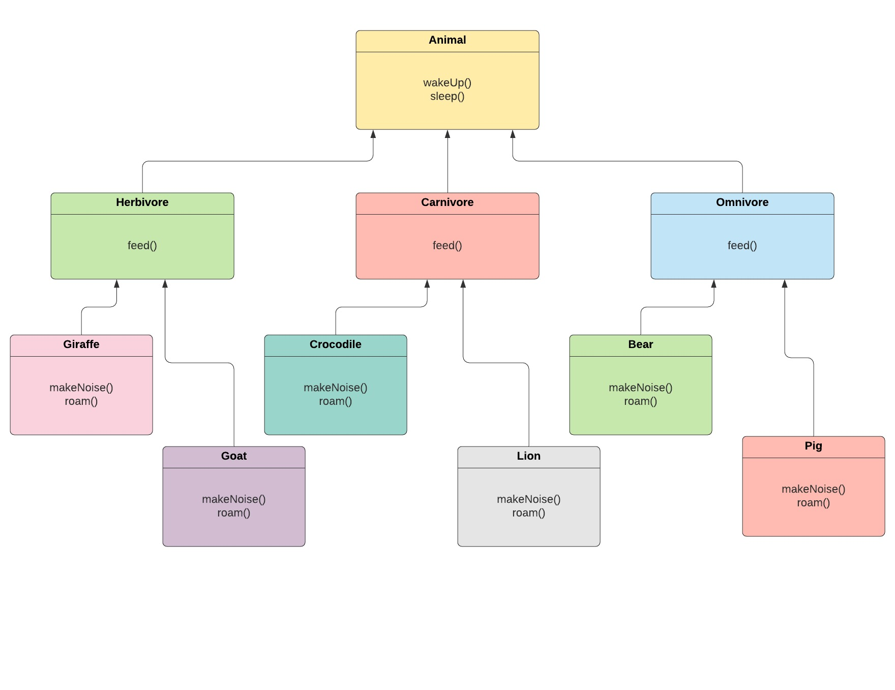

# CSCI 5448 : Object Oriented Analysis and Design - Project 1
**Team  Members :** 
1. Amatullah Sethjiwala
2. Keerthika Rajvel
3. Swarnalatha Natarajan

**Question 1(b)** 
1. Language used for development : Python
2. Environment used : Jupyter notebook
**Question 1(b)** 
For this question, we implemented the startegy pattern. Our previous project had the following class structure : 

Since the method 'roam()' varies among different kinds of animals, it is taken outside the class and encapsulated. We create a RoamBehaviour Interface that has a set of classes representing it's behaviour : WalkBehaviour, SwimBehaviour and RunBehaviour. The various subclasses then choose from these classes of behaviours. 
The class diagram and sequence diagram for this is in the .doc file submitted.  
**Question 1(c)** 
For this question, we implemented the observer pattern.
The Zoo keeper is the observable class and the Zoo announcer is the observer class.
Initially, the Zoo announcer is registered as an observer of the Zoo keeper.
The Zoo announcer continuously observes the Zoo keeper and when the Zoo keeper's task changes, the Zoo announcer gets notified.
Once the Zoo Keeper completes his last task for the day, the Zoo Announcer is removed from the Zoo Keeper's list of observers.
