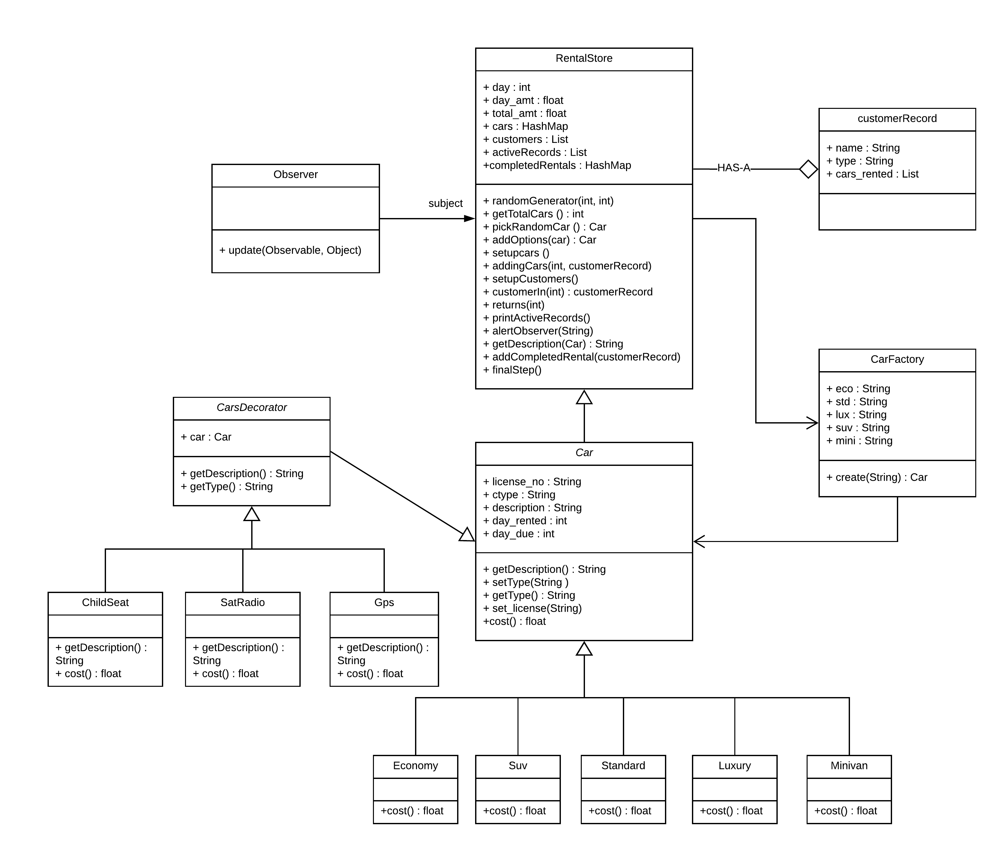

# CSCI 5448 : Object Oriented Analysis and Design - Project 3
**Team  Members :** 
1. Amatullah Sethjiwala
2. Keerthika Rajvel
3. Swarnalatha Natarajan

**Instructions to run the code**
1. The program RentalStore.java has the car rental business simulator in the main function.
2. Language used for development : Java8
3. Environment used for development : Visual Studio

**Program Design**
  
The Car Rental Business Simulator has been implemented with the help of the classes RentalStore, CustomerRecord and Car. The RentalStore class has the car rental business simulator evoked in its main function.   
**- Intial Setup using Factory Pattern :**  
In the car rental business simulator, it begins by creating the 24 cars in the rental store inventory with the help of the classes CarFactory and Car. The Factory pattern used here helps in encapsulating all the instatiation of the car objects together. After the creation of car objects, the initial set of 12 customers are set up with the help of the setupCustomers() function in Class RentalStore. This function randomly generates the 12 customers with randomly chosen customer type and random number of cars in the customer's active record in the rental store. Now, the rental store has 12 customers and 24 cars set up in its inventory.  
**- Car Return :**  
Further, Everyday begins by evoking the returns() function which checks if there is any car return due on that particular day. If yes, that particular car due is returned. As a result, the active records and the rental store inventory are updated accordingly.  
**- 35 Days Customer-In Simulation :**  
For 35 days, the customerIn() function is evoked to randomly generate an incoming customer. This customer could be an active customer or an existing customer (i.e. a customer who had rented a car in the past) or a new customer. All the above cases are handled accordingly. As a result, the active records and the rental store inventory are updated accordingly.  
**- Car Add-ons using Decorator Pattern :**  
The functionality of adding options such as Child seat, GPS module and radio sattelite to the cars has been efficiently implemented using the Decorator pattern. This pattern helps in handling the cost of each car with respect to the add-ons.  
**- Alerts using Observer Pattern :**  
All the changes made by the Rental store class is observed by the observer class and it furnishes all the details in an output file called carSimulator.out. The Observer pattern here helps in reporting each and every change made in the rental store's active records and the car inventory dynamically.  
**- Final Output :**  
Everyday, the completed rentals, the active rentals and the cars left in the inventory are displayed. At the end of th 35th day, the total cost and the total number of completed rentals (including any rentals that occurred on the 35th day), overall and by type of customer (casual, business, regular) are displayed. 
