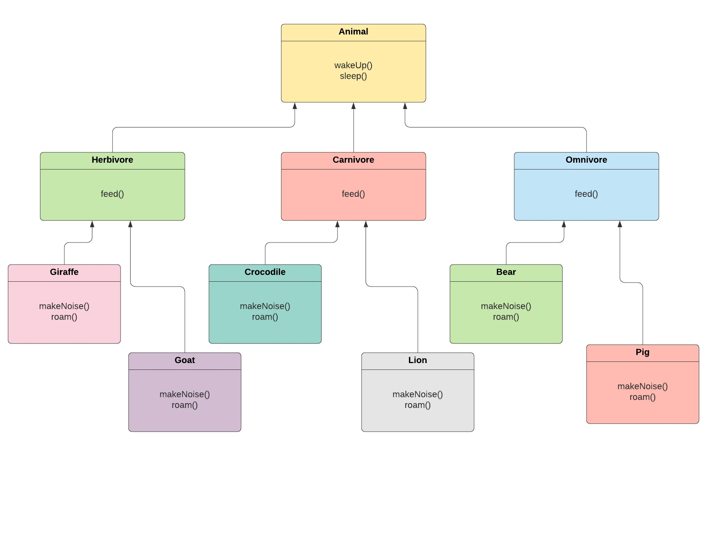

# CSCI 5448 : Object Oriented Analysis and Design - Project 1
**Team  Members :** 
1. Amatullah Sethji
2. Keerthika Rajvel
3. Swarnalatha Natarajan

**Levels of Inheritance in Animals**

The Animal class is the super class with wakeUp() and sleep() methdods. Classes Herbivore, Carnivore and Omnivore extend/inherit from class Animal. These 3 classes contain a feed() method. The last level of inheritance contains classes for each of the 3 aforementioned classes. Class Herbivore is inherited by Giraffe and Goat classes; class carnivore is inherited by Crocodile and Lion classes; class Omnivore is inherited by Bear and Pig classes. Each class in the last level of inheritance has makeNoise() and roam() methods.

The randomize feature has been incorporated in the Giraffe class where the each of the inherited methods are overridden with a different random functionality inside the class. For instance, <fill>
